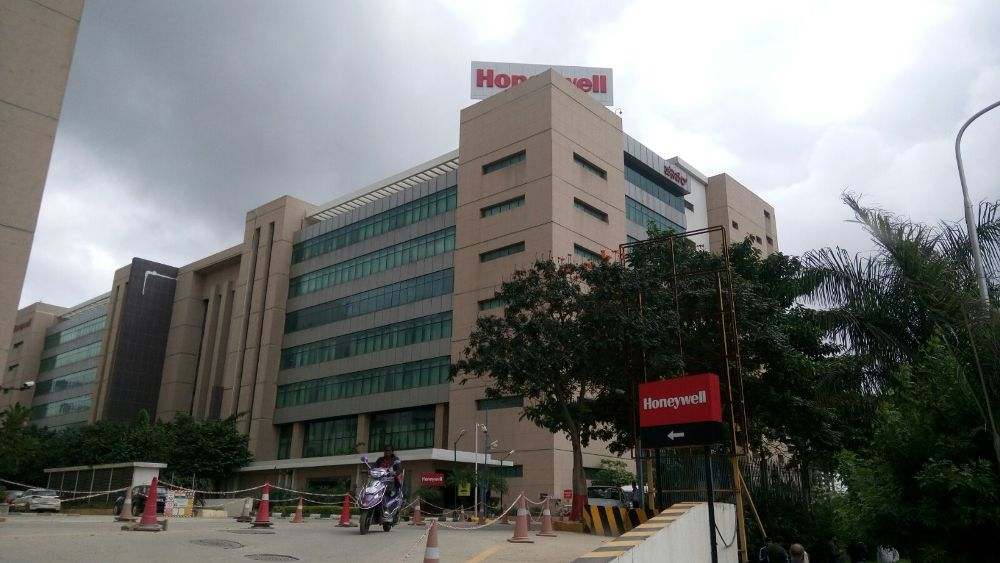

### About Me: Sridevi Melnatami Prasanna
### Team Lead @Honeywell from 2002 till 2012.

Performed various engineering duties, with increasing responsibilities, starting as a test engineer to Team Leader at Honeywell. Lead global teams delivering very critical complex embedded real-time systems (Cabin pressure controller) that required in-depth understanding of technologies, solutions, processes and products in Aerospace domain.

As a Team leader, led the software development, verification & validation and FAA certification for the entire Cabin pressure controller product line (including Falcon7X, Hawker Horizon and Gulfstream G650) across multiple global locations. First team to ever use auto-code (BEACON )/test generator(AUTT) for a DO178 Level B software.

Travelled to Tucson, Arizona various times to carry out the Final Qualification Testing of the Cabin Pressure Control System.

Skills: Embedded Operating Systems · Embedded Software Programming · DO-178B · Project Planning · Process Improvement · Problem Solving · Python (Programming Language) · C (Programming Language) . BEACON . CODETEST. Testing. Verification and Validation
 
Significant Achievements:
- Recipient of the Honeywell BRAVO Award (for exemplifying workplace behavior that differentiates levels of performance and exhibit Honeywell Behaviors at a role model level and develop them personally and in others thus driving personal and business success).
- Six Sigma Green Belt certified.

<!--
**mpsridevi/mpsridevi** is a ✨ _special_ ✨ repository because its `README.md` (this file) appears on your GitHub profile.

Here are some ideas to get you started:

- 🔭 I’m currently working on ...
- 🌱 I’m currently learning ...
- 👯 I’m looking to collaborate on ...
- 🤔 I’m looking for help with ...
- 💬 Ask me about ...
- 📫 How to reach me: ...
- 😄 Pronouns: ...
- ⚡ Fun fact: ...
-->
