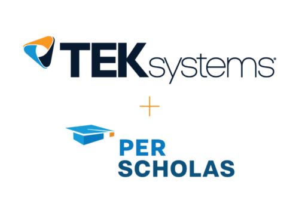

### About Me: Sridevi Melnatami Prasanna

Passionate about Automation testing with writing the scripts and create automation environments for repeated tests. My goal is to automate as much of the testing effort as possible with the minuimum set of code. Working on Python scripts with Selenium model projects to test the web applications. Being detail oriented helps me to isolate the problems and find ways to improve them. 

### Data Engineering Course - 2023

Successfully completed Data Engineering course along with a 12 session professional development coaching.
During the course, I underwent extensive training in Python programming, GIT version control, SQL, Linux. Technologies used were MySQL work bench, Visual Source code, Tableau, Jupyter Notebooks, RestAPI, Selenium, Apache Spark, ETL processes and Big data.

### Generation USA - 2021

Junior Cloud Practitioner program with soft skills training of Behavioral skills and growth mindset. The training helped me to get certified in AWS Certified Cloud Practitioner. 

### Team Lead @Honeywell from 2002 till 2012.

Performed various engineering duties, with increasing responsibilities, starting as a test engineer to Team Leader at Honeywell. Lead global teams delivering very critical complex embedded real-time systems (Cabin pressure controller) that required in-depth understanding of technologies, solutions, processes and products in Aerospace domain.

As a Team leader, led the software development, verification & validation and FAA certification for the entire Cabin pressure controller product line (including Falcon7X, Hawker Horizon and Gulfstream G650) across multiple global locations. First team to ever use auto-code (BEACON )/test generator(AUTT) for a DO178 Level B software. Involved in quality assurance, test case, test procedure development, code coverage analysis and complete statement, decision and Modified Condition / Decision Coverage (MC/DC). Participated in Testing documentation reviews and walkthroughs, including those for Test plans, Test cases, Test strategies, Test Summary Reports.

My analytical skills helped me to priortize necessary tests and streamline application fuctions through automated testing process.

Travelled to Tucson, Arizona various times to carry out the Final Qualification Testing of the Cabin Pressure Control System.

Skills: Embedded Operating Systems · Embedded Software Programming · DO-178B · Project Planning · Process Improvement · Problem Solving · Python (Programming Language) · C (Programming Language) . BEACON . CODETEST. Testing. Verification and Validation
Behavioral skills: Strong verbal and written communication skills, Detail oriented, Motivated, Commitment, Respect.
 
Significant Achievements:
- Recipient of the Honeywell BRAVO Award (for exemplifying workplace behavior that differentiates levels of performance and exhibit Honeywell Behaviors at a role model level and develop them personally and in others thus driving personal and business success).
- Six Sigma Green Belt certified.
- Recipient of the various Honeywell Awards like Team Excellence Award, Team Achievement Award, IP Award etc. Check my achievements and trainings under Awards and Trainings folder. (The Honeywell awards contains my old name Sridevi Kuduva Subramanian)

<!--
**mpsridevi/mpsridevi** is a ✨ _special_ ✨ repository because its `README.md` (this file) appears on your GitHub profile.

Here are some ideas to get you started:

- 🔭 I’m currently working on ...
- 🌱 I’m currently learning ...
- 👯 I’m looking to collaborate on ...
- 🤔 I’m looking for help with ...
- 💬 Ask me about ...
- 📫 How to reach me: ...
- 😄 Pronouns: ...
- ⚡ Fun fact: ...
-->
